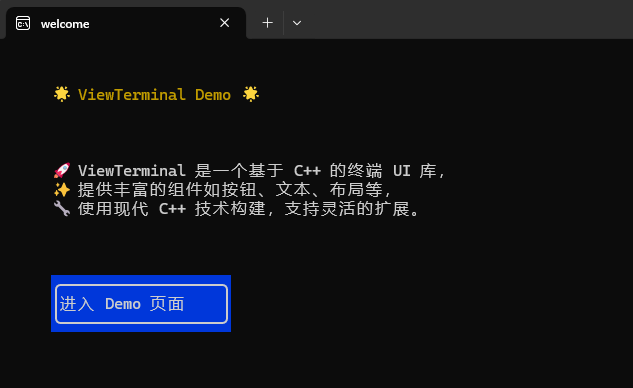

# ViewTerminal

<div align="center">
  
  <p><i>ViewTerminal - 控制台界面框架示例</i></p>
</div>

## 📖 简介

ViewTerminal 是一个轻量级的 Windows 控制台 UI 框架，使开发者能够在控制台环境下创建丰富的交互式用户界面。它提供了类似于 GUI 的组件、布局和事件系统，让您可以构建复杂的控制台应用程序，而无需处理底层的控制台 API 细节。

## ✨ 特性

- **丰富的组件系统**
  - 按钮 (Button)
  - 文本显示 (Text)
  - 文本输入框 (InputText)
  - 列表 (List)
  - 分割线 (Line)

- **灵活的布局管理**
  - 水平布局 (Span)
  - 垂直布局 (Div)
  - 自定义间距和填充

- **强大的事件系统**
  - 鼠标事件
  - 键盘事件
  - 值变更事件
  - 自定义事件

- **页面管理与导航**
  - 页面栈管理
  - 多种导航方式 (导航、重定向、重新启动)

- **高效渲染引擎**
  - 差异渲染 (只更新变化的部分)
  - 双缓冲区实现
  - 支持 Unicode 字符 (包括中文和特殊字符)

## 📝 开发计划

- [ ] 增加Linux支持
- [ ] 增加组件层级管理
- [ ] 改进事件传递方式
- [ ] 支持更多的UI组件 (如复选框、单选按钮、进度条等)
- [ ] 改进键盘焦点管理系统

## 🔍 用法示例

### 创建应用和页面

```cpp
#include <viewterminal/App.h>

// 定义一个页面类
class LoginPage : public View::PageBase
{
public:
    // 构造函数需要传递 Renderer 对象
    LoginPage(View::Renderer& render) : View::PageBase(render) {}
    
    // 初始化页面组件
    void initComponents() override {
        // 创建标题文本
        auto titleText = new View::Text(render, L"登录系统", 5, 2, 20, 1);
        titleText->setColorStyle(View::Color::BRIGHTWHITE, View::Color::BLUE);
        
        // 创建用户名输入框
        auto usernameInput = new View::InputText(render, L"请输入用户名", 5, 4, 30, 1);
        
        // 创建密码输入框
        auto passwordInput = new View::InputText(render, L"请输入密码", 5, 6, 30, 1);
        
        // 创建登录按钮
        auto loginButton = new View::Button(render, L"登录", 5, 8, 10, 3);
        loginButton->addEventListener(View::EventType::CLICK, [this](View::EventArgs* args) {
            // 处理登录逻辑
            app->navigateTo(L"main");
        });
        
        // 将组件添加到页面
        addComponent(titleText);
        addComponent(usernameInput);
        addComponent(passwordInput);
        addComponent(loginButton);
    }
};

// 创建应用实例
int main() {
    // 创建应用 (控制台大小参数)
    View::App app(120, 30);
    
    // 初始化日志
    View::initLog(L"app.log", View::LogLevel::LOG_DEBUG);
    
    // 注册页面
    std::map<std::wstring, std::unique_ptr<View::PageBase>> pages;
    pages[L"login"] = std::make_unique<LoginPage>(app.getRenderer());
    pages[L"main"] = std::make_unique<MainPage>(app.getRenderer());
    
    app.registerPages(pages);
    
    // 启动应用，导航到登录页面
    app.navigateTo(L"login");
    
    return 0;
}
```

### 使用布局系统

```cpp
// 在 initComponents() 中创建布局
auto mainLayout = new View::Div(render, 0, 0, 80, 20);

// 创建一个水平布局
auto headerSpan = std::make_shared<View::Span>(render, 0, 0, 80, 3);

// 添加组件到水平布局
headerSpan->addComponent(std::make_shared<View::Text>(render, L"标题", 0, 0, 20, 1));
headerSpan->addComponent(std::make_shared<View::Button>(render, L"设置", 0, 0, 10, 1));

// 添加水平布局到主布局
mainLayout->addComponent(headerSpan);

// 设置布局间距
mainLayout->setSpace(1);

// 将主布局添加到页面
addComponent(mainLayout);
```

## 🛠️ 如何构建

### 前提条件

- Windows 操作系统
- Visual Studio 2019 或更高版本
- C++17 支持

### 使用 Visual Studio 构建

1. 克隆仓库
   ```
   git clone https://github.com/yourusername/ViewTerminal.git
   ```

2. 打开 Visual Studio 解决方案文件
3. 选择配置 (Debug/Release)
4. 构建解决方案

### 集成到您的项目

1. 添加 include 目录到您的项目
2. 链接 ViewTerminal 库
3. 包含头文件 `#include <viewterminal/App.h>`

## 🤝 贡献

欢迎贡献！如果您有任何想法、bug报告或功能请求，请提交Issue或Pull Request。

## 📚 参考

- [示例项目](https://github.com/zsl503/CommodityManagement)
- [Windows Console API 文档](https://docs.microsoft.com/en-us/windows/console/)
